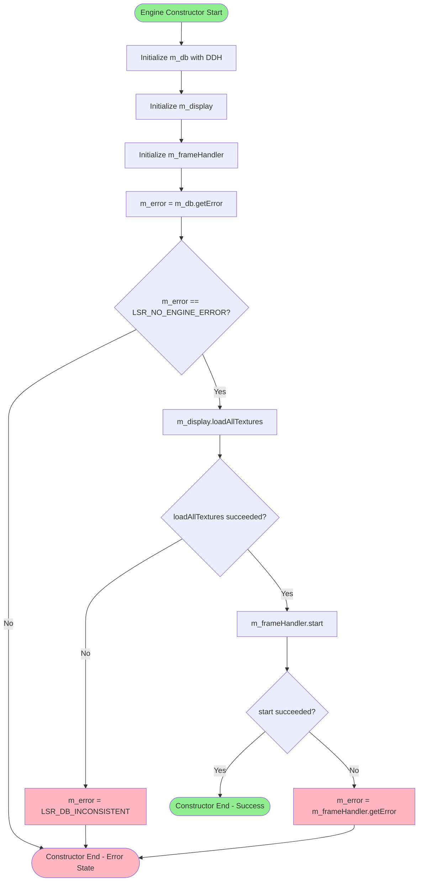
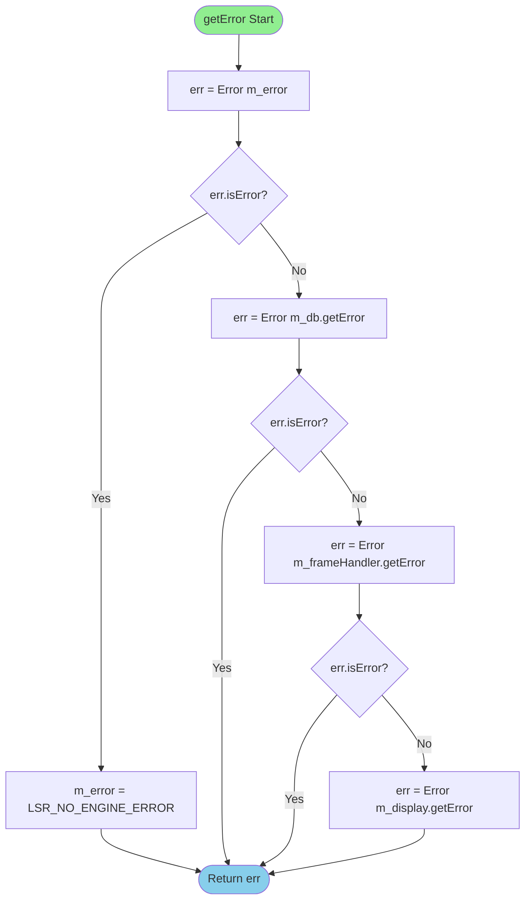
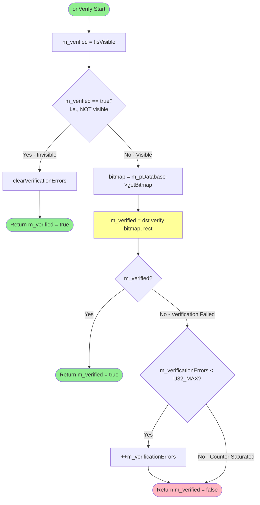
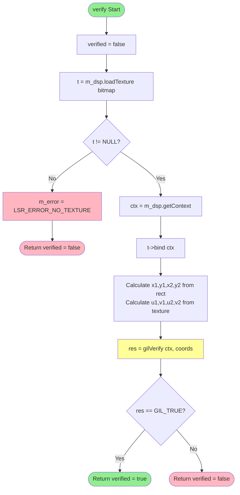
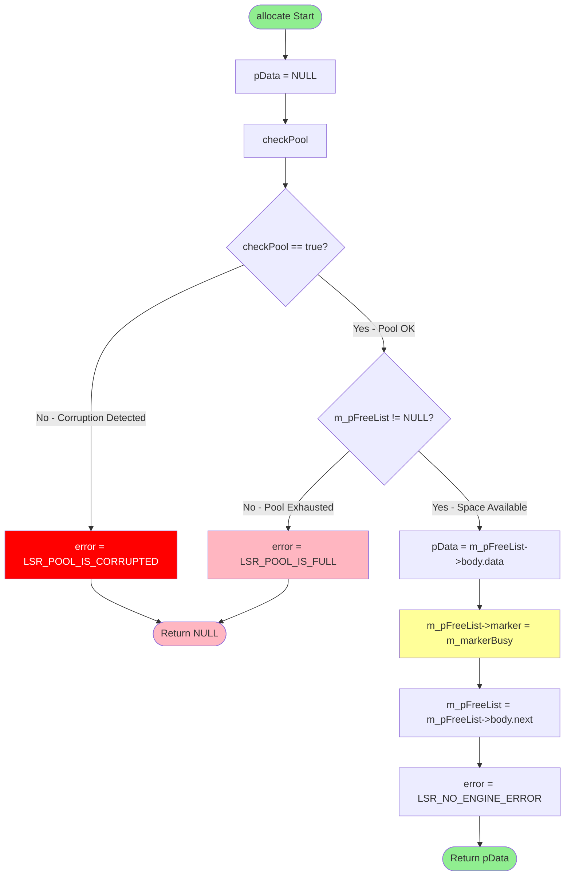
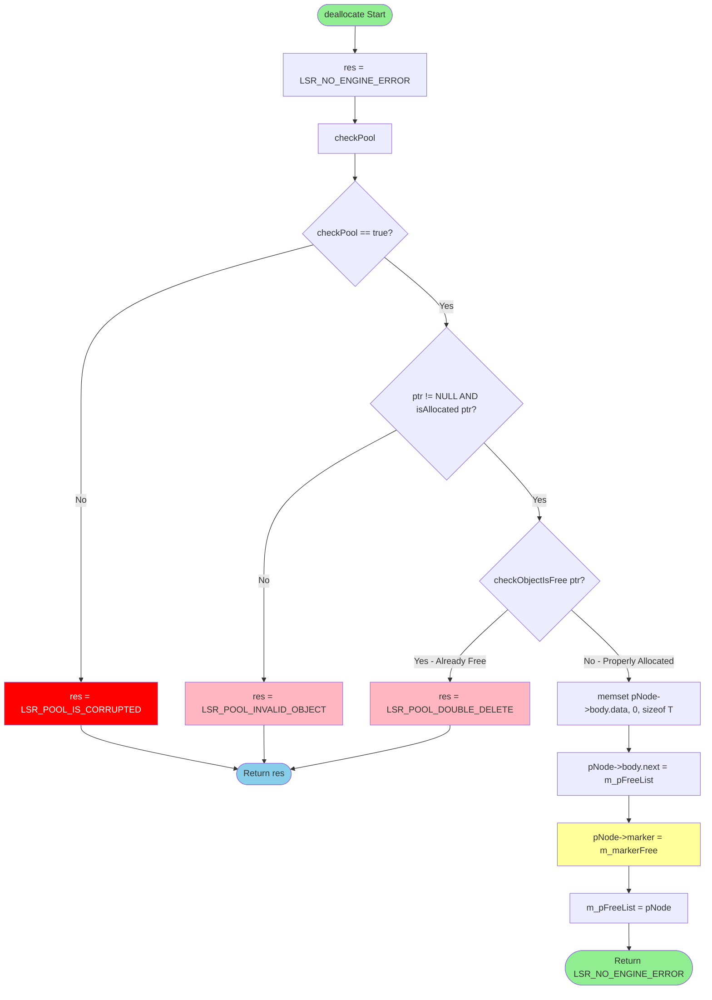
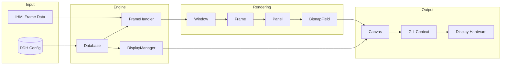
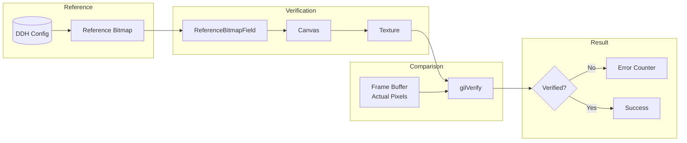
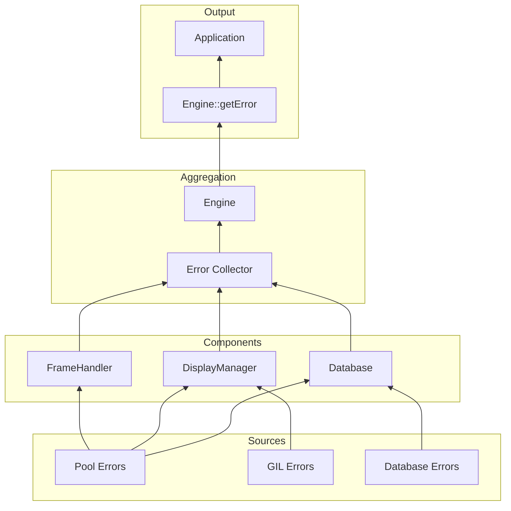
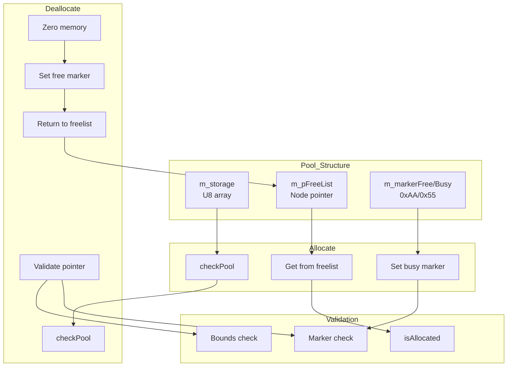

# LSR-CFA-001: Control Flow and Data Flow Analysis

| Document ID | LSR-CFA-001 |
|-------------|--------------|
| Version | 1.0 |
| Date | 2026-05-12 |
| Status | Draft |
| Classification | Safety-Critical |
| Standard | ISO 26262:2018 Part 6 |

---

## 1. Introduction

This document presents control flow and data flow analysis for safety-critical functions in the Luxoft Safe Renderer. The analysis identifies:
- Execution paths through critical functions
- Data dependencies and transformations
- Potential safety-relevant paths
- Unreachable code analysis

---

## 2. Control Flow Analysis

### 2.1 Engine::Engine() Constructor - Initialization Flow

**Source**: `engine/lsr/src/Engine.cpp:24-45`

**Critical Paths**:
| Path ID | Condition | Result | ASIL Impact |
|---------|-----------|--------|-------------|
| P1 | DB error at startup | Error state retained | SG2 - Availability |
| P2 | Texture load failure | LSR_DB_INCONSISTENT | SG1 - Correct Display |
| P3 | FrameHandler start failure | Component error | SG2 - Availability |
| P4 | All checks pass | Successful init | Normal operation |

---

### 2.2 Engine::getError() - Error Aggregation Flow

**Source**: `engine/lsr/src/Engine.cpp:62-83`

**Error Priority Order**:
1. Engine-level error (m_error) - highest priority
2. Database error (m_db.getError())
3. FrameHandler error (m_frameHandler.getError())
4. Display error (m_display.getError()) - lowest priority

---

### 2.3 ReferenceBitmapField::onVerify() - Verification Flow

**Source**: `engine/framehandler/src/ReferenceBitmapField.cpp:61-84`

**Safety-Critical Paths**:
| Path | Condition | Outcome | Safety Relevance |
|------|-----------|---------|------------------|
| Invisible Path | Field not visible | Skip verification, clear errors | Intentional bypass |
| Success Path | Pixel match | Return true | Normal operation |
| Failure Path | Pixel mismatch | Increment counter, return false | **SG4 - Corruption Detection** |
| Overflow Path | Counter at max | No increment, return false | Counter saturation handling |

---

### 2.4 Canvas::verify() - Pixel Verification Flow

**Source**: `engine/display/src/Canvas.cpp:76-106`

---

### 2.5 Pool::allocate() - Memory Allocation Flow

**Source**: `engine/common/api/Pool.h:191-216`

**Safety Mechanisms**:
| Check | Purpose | Error Code |
|-------|---------|------------|
| checkPool() | Detect memory corruption | LSR_POOL_IS_CORRUPTED |
| m_pFreeList != NULL | Detect exhaustion | LSR_POOL_IS_FULL |
| Marker update | Track allocation state | 0x55 pattern |

---

### 2.6 Pool::deallocate() - Memory Deallocation Flow

**Source**: `engine/common/api/Pool.h:218-256`

**Multi-Level Validation**:
1. Pool integrity check (checkPool)
2. Pointer validity (ptr != NULL && isAllocated)
3. Double-free detection (checkObjectIsFree)
4. Memory zeroing before free (security measure)

---

## 3. Data Flow Analysis

### 3.1 Render Pipeline Data Flow

### 3.2 Verification Data Flow

### 3.3 Error Propagation Data Flow

### 3.4 Pool Memory Data Flow

---

## 4. Critical Path Analysis

### 4.1 Safety-Critical Execution Paths

| Path ID | Function | Critical Decision | Safety Impact |
|---------|----------|-------------------|---------------|
| CP-001 | Engine::Engine | Texture load check | Display availability |
| CP-002 | Engine::getError | Error priority chain | Error visibility |
| CP-003 | ReferenceBitmapField::onVerify | Visibility check bypass | Verification control |
| CP-004 | ReferenceBitmapField::onVerify | Pixel comparison | Corruption detection |
| CP-005 | Canvas::verify | Texture load | Verification validity |
| CP-006 | Pool::allocate | Pool integrity check | Memory safety |
| CP-007 | Pool::deallocate | Double-free check | Memory corruption prevention |

### 4.2 Cyclomatic Complexity

| Function | Complexity | Risk Level |
|----------|------------|------------|
| Engine::Engine() | 4 | Low |
| Engine::getError() | 5 | Low |
| Pool::allocate() | 3 | Low |
| Pool::deallocate() | 5 | Low |
| Pool::checkPool() | 4 | Low |
| ReferenceBitmapField::onVerify() | 4 | Low |
| Canvas::verify() | 3 | Low |

All critical functions have cyclomatic complexity ≤ 10, which is acceptable for ASIL D.

---

## 5. Unreachable Code Analysis

### 5.1 Identified Defensive Code

| Location | Code | Status | Justification |
|----------|------|--------|---------------|
| Pool::allocate:210 | `else` after `checkPool()` fails | Reachable | Corruption detection path |
| Pool::deallocate:250 | `else` for corrupted pool | Reachable | Corruption detection path |
| Engine.cpp:42 | Empty `else` clause | Intentional | MISRA compliance placeholder |

### 5.2 Dead Code Assessment

No unreachable code identified in analyzed functions. All branches are reachable under specific conditions.

---

## 6. Summary

### 6.1 Control Flow Findings

- All critical functions have bounded complexity (≤ 5)
- No infinite loops possible in analyzed code
- All error paths terminate with appropriate error codes
- Multi-level validation in Pool operations

### 6.2 Data Flow Findings

- Clear data ownership throughout render pipeline
- Error propagation follows defined hierarchy
- No circular data dependencies
- Reference bitmap data integrity maintained through verification chain

### 6.3 Recommendations

1. **Pool::checkPool()** should be called before every pool operation (currently implemented)
2. **Error aggregation** correctly prioritizes engine-level errors
3. **Verification bypass** for invisible fields is intentional and documented

---

**End of Document**
